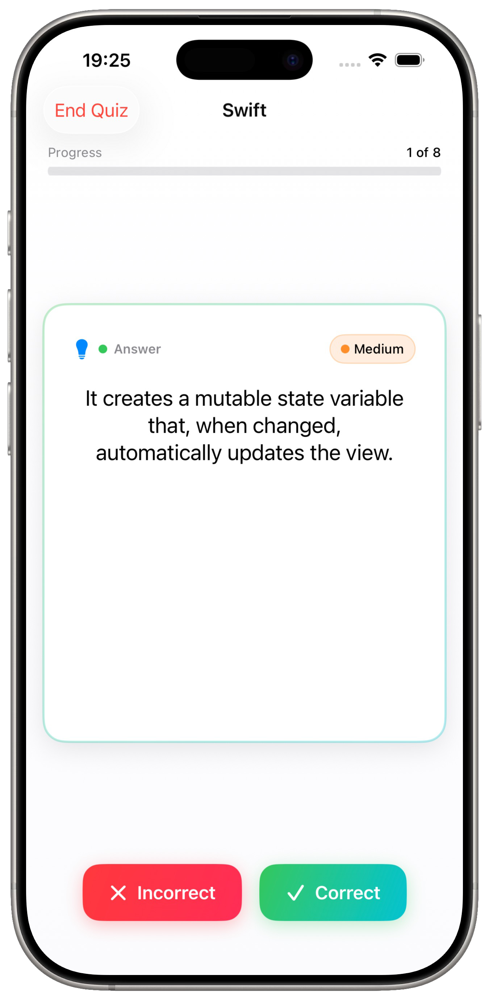

#  FlipCards

*A beautifully designed iOS flashcard app that makes learning enjoyable and effective*

  
  
  
  

##  Features

<table>
<tr>
<td width="50%">

### Beautiful Design
- Clean, modern interface built with SwiftUI
- Smooth gradient backgrounds and polished animations
- Intuitive navigation and user experience
- Adaptive design that looks great on all iOS devices

###  Smart Deck Management
- Create unlimited custom flashcard decks
- Choose from **30+ beautiful icons** for each deck (academic, STEM, languages, arts, and more)
- **8 vibrant color themes** to personalize your decks
- Organize cards by difficulty levels (Easy, Medium, Hard)

</td>
<td width="50%">

###  Interactive Quiz Mode
- Flip cards to reveal answers with smooth animations
- Track your performance with detailed statistics
- Mark answers as correct or incorrect
- Real-time progress tracking during quiz sessions
- Performance analytics showing correct answer percentages

###  Progress Tracking
- Monitor how many times you've reviewed each card
- Track your accuracy rate per card
- View last reviewed dates
- Identify cards that need more practice

</td>
</tr>
</table>

<b> Customization Options</b>

- **Icon Library**: Choose from academic subjects (books, calculator, globe), STEM fields (computer, atom, circuit), languages (dictionary, writing), sciences (chemistry, biology), arts (camera, palette), sports, and general icons
- **Color Themes**: Blue, Purple, Green, Orange, Red, Pink, Teal, and Indigo
- **Difficulty Levels**: Visual indicators for Easy (green), Medium (orange), and Hard (red) cards

##  Screenshots

  <table>
    <tr>
      <td align="center">
        
         
        <b> Home Screen</b>
         
        <i>Beautiful deck grid with custom icons and colors</i>
      </td>
      <td align="center">
        
         
        <b> Deck Management</b>
         
        <i>Card creation and organization</i>
      </td>
      <td align="center">
        
         
        <b> Quiz Experience</b>
         
        <i>Interactive learning with progress tracking</i>
      </td>
    </tr>
  </table>

---

##  Technical Info

<b>Built with Modern iOS Technologies and swiftUI</b>

- **SwiftUI**: Native, declarative UI framework
- **SwiftData**: Persistent data storage with Core Data backing
- **iOS 15.0+**: Leveraging the latest iOS capabilities

### Architecture Highlights
- Clean MVVM architecture
- Persistent local storage with SwiftData
- Smooth animations and transitions
- Responsive design principles

### Data Models
- **Deck**: Contains name, icon, color, and collection of cards
- **Card**: Front/back text, difficulty level, performance statistics
- **Statistics**: Track review frequency and accuracy rates

---

## Perfect For

<table>
<tr>
<td align="center" width="20%">
 <b>Students</b> 
<i>Study for exams, learn vocabulary, memorize formulas</i>
</td>
<td align="center" width="20%">
 <b>Language Learners</b> 
<i>Build vocabulary, practice phrases, learn grammar</i>
</td>
<td align="center" width="20%">
 <b>Professionals</b> 
<i>Memorize industry terms, certification materials</i>
</td>
<td align="center" width="20%">
 <b>Educators</b> 
<i>Create study materials for students</i>
</td>
<td align="center" width="20%">
 <b>Anyone</b> 
<i>Learn new skills, hobbies, or general knowledge</i>
</td>
</tr>
</table>

## User Experience

> FlipCards focuses on simplicity and effectiveness. The app removes distractions and lets you focus on what matters: learning. With its beautiful design and smooth interactions, studying becomes a pleasure rather than a chore.

<table>
<tr>
<td align="center" width="25%">
 <b>Minimalist</b> 
<i>Clean interface without clutter</i>
</td>
<td align="center" width="25%">
 <b>Intuitive</b> 
<i>Natural gestures and familiar patterns</i>
</td>
<td align="center" width="25%">
 <b>Fast</b> 
<i>Quick access to all features</i>
</td>
<td align="center" width="25%">
 <b>Accessible</b> 
<i>Designed for users of all ages and abilities</i>
</td>
</tr>
</table>

##  What Makes FlipCards Special

<blockquote>
Unlike complex flashcard apps with overwhelming features, FlipCards strikes the perfect balance between functionality and simplicity. It's designed to look beautiful and work seamlessly, making your study sessions more enjoyable and effective.
  
The app doesn't rely on complex algorithms, instead it provides you with the tools to study at your own pace, your own way. Sometimes the best learning app is the one that gets out of your way and lets you focus on learning.
</blockquote>

---
